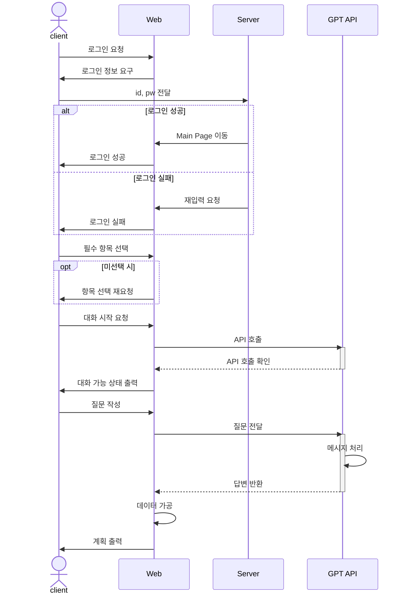
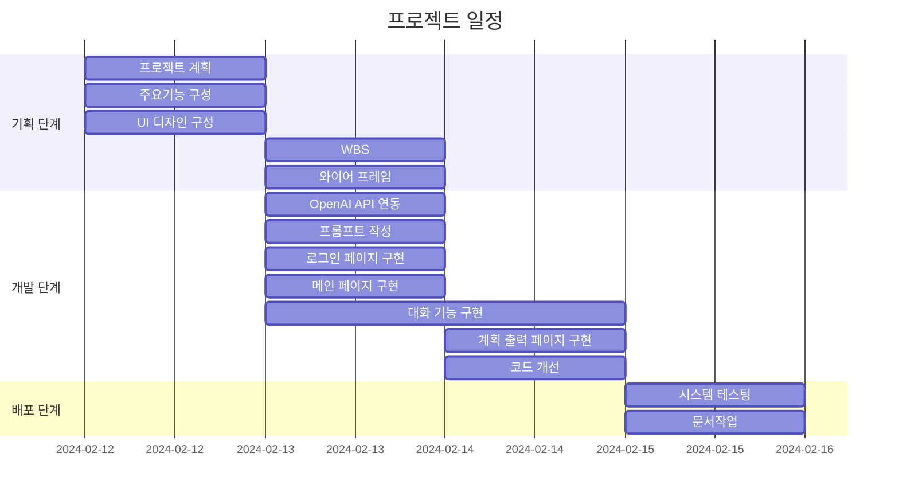
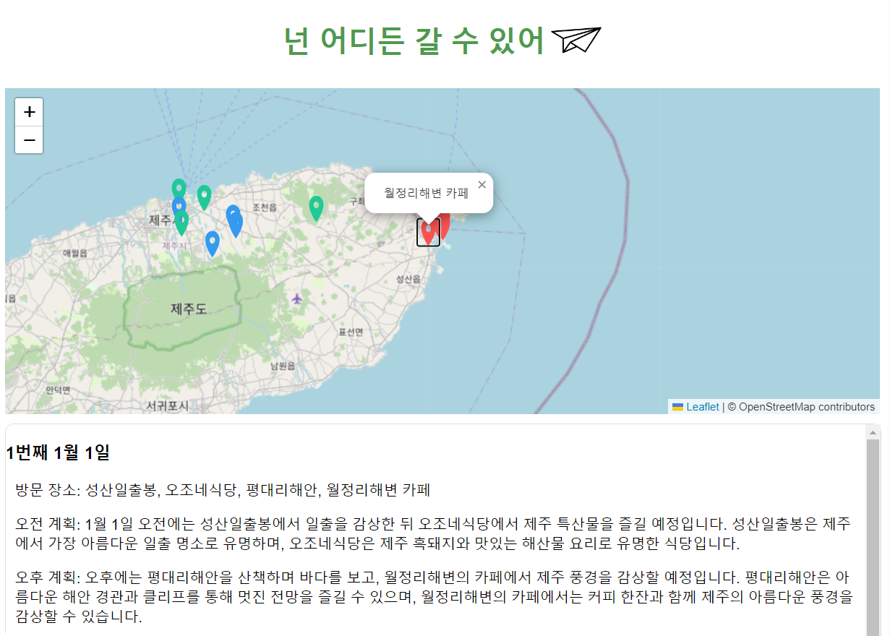
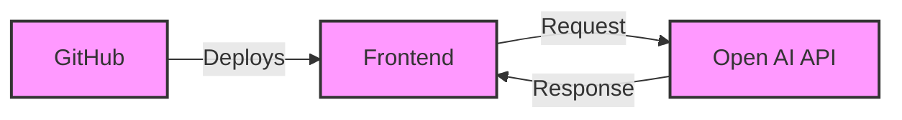
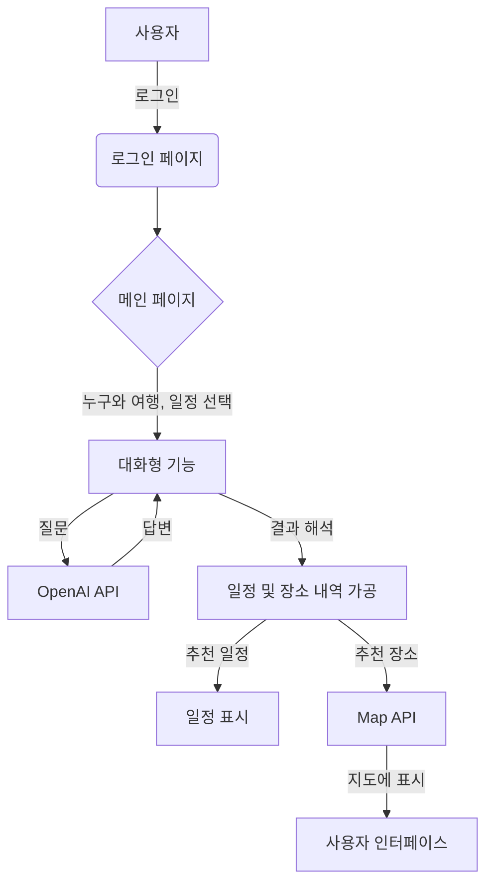

# 🚀 넌 어디든 갈 수 있어
<p align="center">

</p>

## 📝 GPT를 활용한 프로젝트 

<strong>"여행 일정을 작성해 봅시다"</strong>

길었던 코로나19 시기가 끝나고 자유롭게 여행을 떠나고 싶지만 여행 계획을 작성하기 힘든 여행자들을 위한 여행 일정 추천 서비스.


## 1. 목표와 기능
### 1.1 목표
- 여행 일정 작성의 고민 시간 감소.
- 유명 관광 명소 추천으로 방문 만족도 증가.
- 새로운 여행지 추천으로 다양한 경험 제공.

### 1.2 기능
- 방문 장소 시각화 자료 제공.
- 챗봇을 통한 대화 기능 제공.
- 카테고리를 통한 그룹별 차별화된 여행 일정 제공


## 2. 개발 환경 및 배포 URL
### 2.1 개발 환경
- Visual Studio Code

### 2.2 배포 URL
- https://um-king.github.io/chatGPT-Web-Project/

## 3. 요구사항 명세와 기능 명세  


## 4. 프로젝트 구조와 개발 일정
### 4.1 프로젝트 구조
```
📦chatGPT_Web_Project  
 ┣ 📂css  
 ┃ ┣ 📜login.css  
 ┃ ┗ 📜style.css  
 ┣ 📂js  
 ┃ ┗ 📜index.js  
 ┣ 📂main  
 ┃ ┣ 📜login.html 
 ┃ ┗ 📜splashscreen.html  
 ┣ 📂image  
 ┃ ┣ 📂marker  
 ┃ ┗ 📂icon
 ┗ 📜index.html  
 
```


### 4.2 개발 일정(WBS)


## 5. 와이어프레임 / UI

### 5.1 와이어프레임

<table>
    <tbody>
        <tr>
            <td>메인</td>
            <td>로그인</td>
        </tr>
        <tr>
            <td>
		
            </td>
            <td>
                
            </td>
        </tr>
        <tr>
           <td>
                
            </td>
	     <td>
                
            </td>
        </tr>
        <tr>
            <td>
                
            </td>
            <td>
            </td>
        </tr>
    </tbody>
</table>

### 5.2 화면 설계
 
<table>
    <tbody>
        <tr>
            <td>로그인</td>
            <td>메인</td>
        </tr>
        <tr>
            <td>
		
            </td>
            <td>
                
            </td>
        </tr>
        <tr>
            <td>채팅</td>
            <td>출력</td>
        </tr>
        <tr>
            <td>
                
            </td>
            <td>
                
            </td>
        </tr>
    </tbody>
</table>
<p align="center">
    
</p>
<p align="center" style="margin-top:-15px"><strong>[서비스 시연]</strong></p>


## 6. Architecture


## 7. 메인 기능
여행 계획 작성 서비스는 사용자의 요청에 따라 사용자의  일정을 작성해주는 서비스로, OpenAI API를 통해 사용자의 요구사항에 맞는 일정을 생성하는 서비스입니다.
대화형 기능을 통해 사용자로부터 여행에 대한 구체적인 선호도와 요구사항을 파악하고 API를 통해 대화 내용에 따른 결과를 만듭니다. 
분석 결과가 반환되면 계획의 내용을 출력하고 지도를 활용하여 관광명소 및 맛집 위치를 표현합니다.





## 8. 에러

- 원하는 요구의 답변을 얻지 못함
  - 좌표를 결과를 반환 받는 내용에서 정확한 위치를 출력하지 못함.
  - 날씨 정보를 요구했을 때 미래의 정보에 대한 예측이 어려움

- 원하는 양식으로 결과가 반환되지 않을 경우 에러.
  - 다시 재요청하기 위해 어떤 대답이 정확한 답변인지 판단이 어려웠다.
  


## 9. 개발하며 느낀점

- 프롬프트의 중요성 
  - 사용자 요구사항에 대한 원하는 답변과 정확한 결과 값을 얻는 과정이 어려웠다. 
  - 어떤 입력을 하고 어떤 설정을 하냐에 따라 결과가 달라지는 것을 확인했고, 해당 기술을 접목하여 효율적인 작업을 하고 싶다.

- 문서 작업에 대한 다양한 경험
  - 프로젝트 문서 작업에 대한 시각화 자료 및 README 작성, 관리 방법 등 다양한 스킬을 경험했다.
  - 프로젝트 개발보다 어려웠던 문서 작업을 직접 수행하여 관리의 중요성을 배웠다.

- 책임감 및 자신감
  - 단순히 미니 프로젝트 제출이 아닌 내 아이디어로 현실화한다고 생각하니 책임감이 컸다.
  - 마감기간을 지키고 더 좋은 결과를 얻기 위해 노력했고 완벽하진 않지만 할 수 있다는 자신감이 생겼다. 
  
