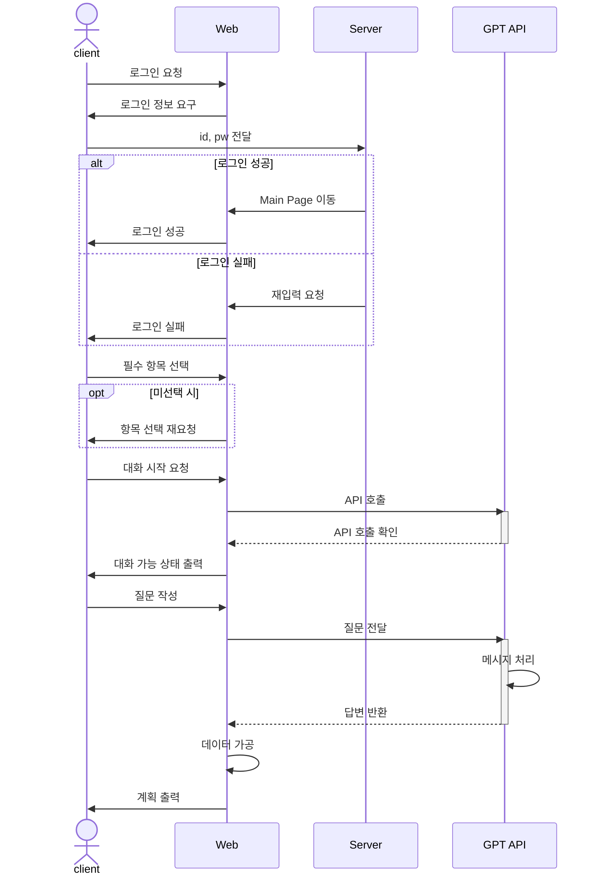
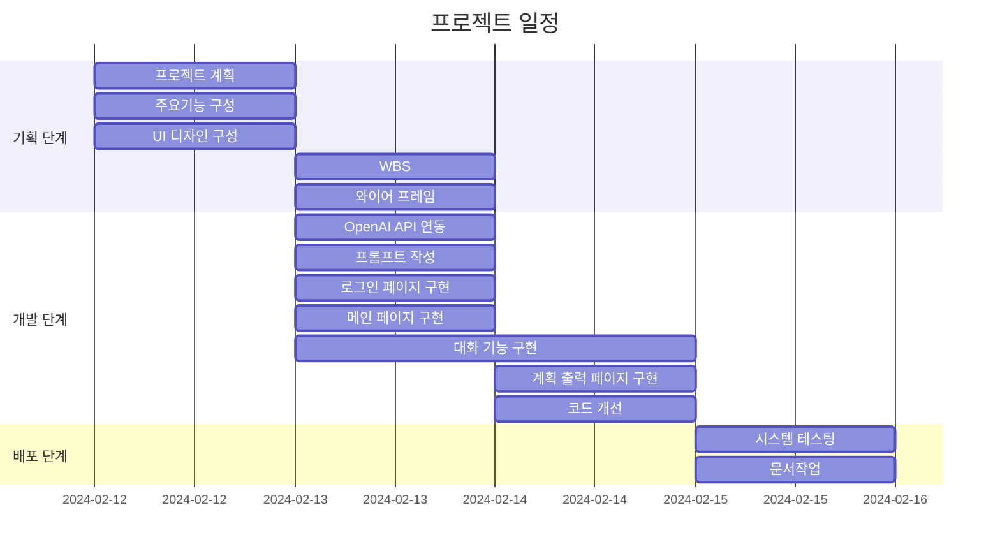
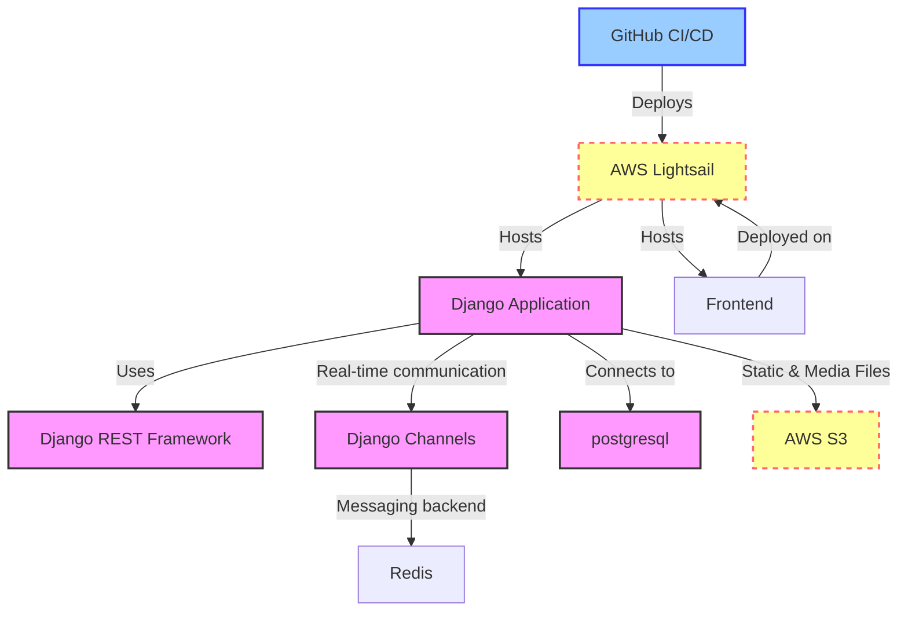
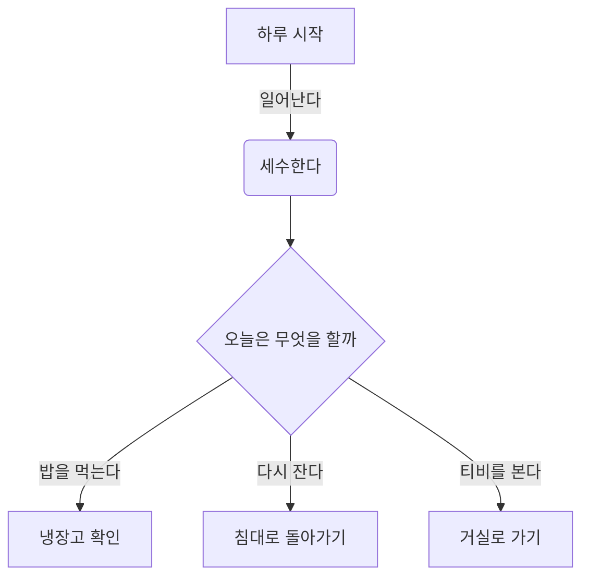
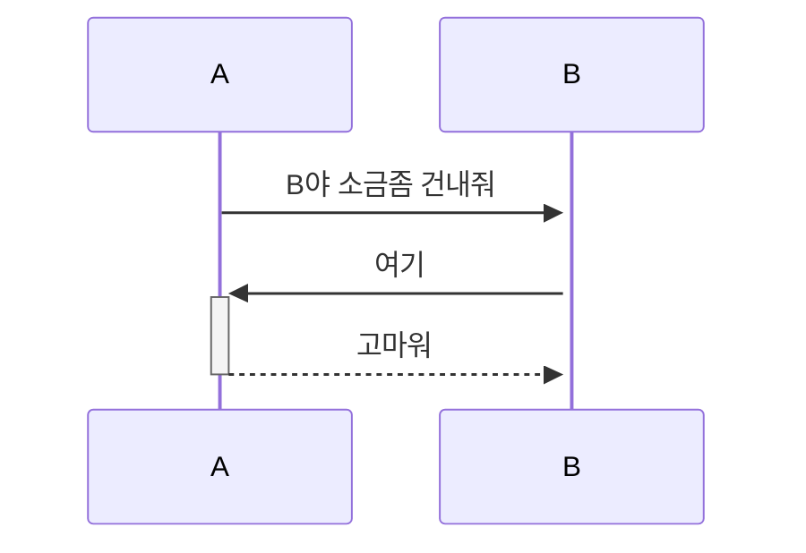
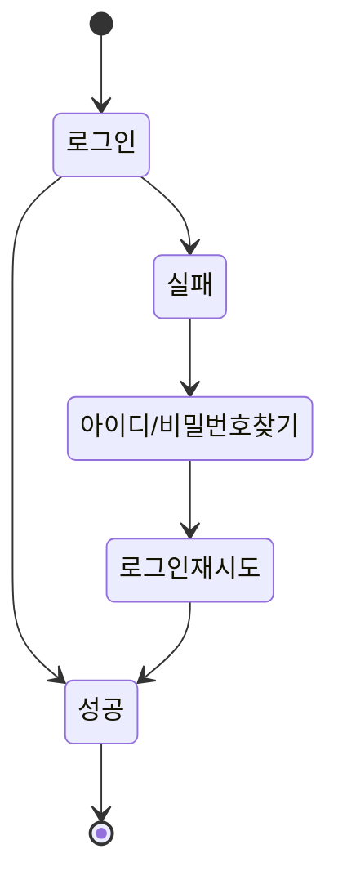

# 🚀 넌 어디든 갈 수 있어
<p align="center">

</p>

## 📝 GPT를 활용한 프로젝트 

<strong>"여행 일정을 작성해 봅시다"</strong>

길었던 코로나19 시기가 끝나고 자유롭게 여행을 떠나고 싶지만 여행 계획을 작성하기 힘든 여행자들을 위한 여행 일정 추천 서비스.


## 1. 목표와 기능
### 1.1 목표
- 여행 일정 작성의 고민 시간 감소.
- 유명 관광 명소 추천으로 방문 만족도 증가.
- 새로운 여행지 추천으로 다양한 경험 제공.

### 1.2 기능
- 방문 장소 시각화 자료 제공.
- 챗봇을 통한 대화 기능 제공.
- 혼자, 친구, 커플, 가족 카테고리를 통한 그룹별 차별화된 여행 일정 제공


## 2. 개발 환경 및 배포 URL
### 2.1 개발 환경
- Visual Studio Code

### 2.2 배포 URL
- https://um-king.github.io/chatGPT-Web-Project/

## 3. 요구사항 명세와 기능 명세  


## 4. 프로젝트 구조와 개발 일정
### 4.1 프로젝트 구조
```
📦chatGPT_Web_Project  
 ┣ 📂css  
 ┃ ┗ 📜style.css  
 ┣ 📂js  
 ┃ ┗ 📜index.js  
 ┣ 📂main  
 ┃ ┣ 📜login.html  
 ┃ ┗ 📜index.html 
 ┣ 📂image  
 ┃  ┣ 📂marker  
 ┃  ┗ 📂icon
 ┗ 📜splashscreen.html 
```


### 4.1 개발 일정(WBS)


## 5. 와이어프레임 / UI / BM

### 5.1 와이어프레임

<table>
    <tbody>
        <tr>
            <td>메인</td>
            <td>로그인</td>
        </tr>
        <tr>
            <td>
		
            </td>
            <td>
                
            </td>
        </tr>
        <tr>
           <td>
                
            </td>
	     <td>
                
            </td>
        </tr>
        <tr>
            <td>
                
            </td>
            <td>
            </td>
        </tr>
    </tbody>
</table>

### 5.2 화면 설계
- 화면은 gif파일로 업로드해주세요.
 
<table>
    <tbody>
        <tr>
            <td>로그인</td>
            <td>메인</td>
        </tr>
        <tr>
            <td>
		
            </td>
            <td>
                
            </td>
        </tr>
        <tr>
            <td>채팅</td>
            <td>출력</td>
        </tr>
        <tr>
            <td>
                
            </td>
            <td>
                
            </td>
        </tr>
    </tbody>
</table>
<p align="center">
    
</p>


## 6. Architecture

* 아래 Architecture 설계도는 ChatGPT에게 아키텍처를 설명하고 mermaid로 그려달라 요청한 것입니다.


* 아래 Architecture 설계도는 PPT를 사용했습니다.
  


- PPT로 간단하게 작성하였으나, 아키텍쳐가 커지거나, 상세한 내용이 필요할 경우 [AWS architecture Tool](https://online.visual-paradigm.com/ko/diagrams/features/aws-architecture-diagram-tool/)을 사용하기도 합니다.

## 7. 메인 기능








## 8. 에러와 에러 해결


## 9. 개발하며 느낀점
