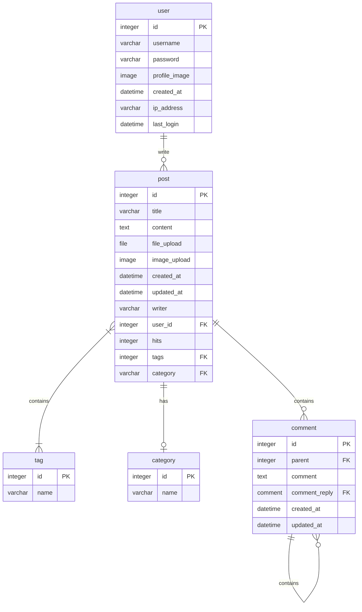

```mermaid
		sequenceDiagram
	    A->>+B: B야 소금좀 건내줘
	    B->>+A: 여기
	    A-->>-B: 고마워
```

# 🚀 넌 어디든 갈 수 있어
<strong>"여행 일정을 작성해 봅시다"</strong>

길었던 코로나19 시기가 끝나고 자유롭게 여행을 떠나고 싶지만 여행 계획을 작성하기 힘든 여행자들을 위한 여행 일정 추천 서비스.

## 📝 GPT를 활용한 프로젝트 

## 1. 목표와 기능
### 1.1 목표
- 여행 일정 작성의 고민 시간 감소.
- 유명 관광 명소 추천으로 방문 만족도 증가.
- 새로운 여행지 추천으로 다양한 경험 제공.

### 1.2 기능
- 방문 장소 시각화 자료 제공.
- 챗봇을 통한 대화 기능 제공.
- 혼자, 친구, 커플, 가족 카테고리를 통한 그룹별 차별화된 여행 일정 제공

## 2. 개발 환경 및 배포 URL
### 2.1 개발 환경
- Visual Studio Code

### 2.2 배포 URL
- Github Page URL

## 3. 요구사항 명세와 기능 명세
- https://www.mindmeister.com/ 등을 사용하여 모델링 및 요구사항 명세를 시각화하면 좋습니다.
- 이미지는 셈플 이미지입니다.

- 머메이드를 이용해 시각화 할 수 있습니다.

```mermaid
    sequenceDiagram
    actor A as client
    participant B as Web
    participant C as server
    A->>+B: 로그인 요청
    B->>+A: 로그인 정보 요구
    A->>+C: id, pw 전달
    alt 로그인 정보가 있고 로그인 정보가 맞을 시
    C->>+B: access token, refresh token 전달
    B->>+A: 로그인 성공
    else 로그인 정보가 없거나 정보가 맞지 않을시
    C->>+B: False
    B->>+A: 로그인 실패
    end
```
  

## 4. 프로젝트 구조와 개발 일정
### 4.1 프로젝트 구조
- 해당 프로젝트에서 폴더 트리 잘 다듬어 사용하세요. 필요하다면 주석을 달아주세요.
📦chatGPT-Web-Project  
 ┣ 📂css  
 ┃ ┗ 📜style.css  
 ┣ 📂js  
 ┃ ┗ 📜index.js  
 ┣ 📂main  
 ┃ ┣ 📜login.html  
 ┃ ┗ 📜index.html 
 ┣ 📂image  
 ┃  ┣ 📂marker  
 ┃  ┗ 📂icon
 ┗ 📜splashscreen.html 

### 4.1 개발 일정(WBS)

```mermaid
gantt
    title 프로젝트 일정
    dateFormat  YYYY-MM-DD

    section 기획 단계
    프로젝트 준비: 2024-02-12, 2024-02-13
    UI/UX 디자인: 2024-02-12, 2024-02-13

    section 개발 단계
    로그인 페이지: 2024-02-13, 2024-02-14
    메인 페이지: 2024-02-13, 2024-02-14
    나의 저장 내역 페이지: 2024-02-14, 2024-02-15

    section 배포 단계
    시스템 테스팅: 2024-02-14, 2024-02-15
    문서작업: 2024-02-15, 2024-02-16
```

## 5. 와이어프레임 / UI / BM

### 5.1 와이어프레임
- 아래 페이지별 상세 설명, 더 큰 이미지로 하나하나씩 설명 필요

- 와이어 프레임은 디자인을 할 수 있다면 '피그마'를, 디자인을 할 수 없다면 '카카오 오븐'으로 쉽게 만들 수 있습니다.

### 5.2 화면 설계
- 화면은 gif파일로 업로드해주세요.
 
<table>
    <tbody>
        <tr>
            <td>메인</td>
            <td>로그인</td>
        </tr>
        <tr>
            <td>
		
            </td>
            <td>
                
            </td>
        </tr>
        <tr>
            <td>회원가입</td>
            <td>정보수정</td>
        </tr>
        <tr>
            <td>
                
            </td>
            <td>
                
            </td>
        </tr>
        <tr>
            <td>검색</td>
            <td>번역</td>
        </tr>
        <tr>
            <td>
                
            </td>
            <td>
                
            </td>
        </tr>
        <tr>
            <td>선택삭제</td>
            <td>글쓰기</td>
        </tr>
        <tr>
            <td>
	        
            </td>
            <td>
                
            </td>
        </tr>
        <tr>
            <td>글 상세보기</td>
            <td>댓글</td>
        </tr>
        <tr>
            <td>
                
            </td>
            <td>
                
            </td>
        </tr>
    </tbody>
</table>

## 6. 데이터베이스 모델링(ERD)

* 아래 ERD는 머메이드를 사용했습니다.

* 아래 ERD는 [ERDCloud](https://www.erdcloud.com/)를 사용했습니다.

* https://dbdiagram.io/home도 많이 사용합니다.

## 7. Architecture

* 아래 Architecture 설계도는 ChatGPT에게 아키텍처를 설명하고 mermaid로 그려달라 요청한 것입니다.

* 아래 Architecture 설계도는 PPT를 사용했습니다.
  

- PPT로 간단하게 작성하였으나, 아키텍쳐가 커지거나, 상세한 내용이 필요할 경우 [AWS architecture Tool](https://online.visual-paradigm.com/ko/diagrams/features/aws-architecture-diagram-tool/)을 사용하기도 합니다.

## 8. 메인 기능

## 9. 에러와 에러 해결

## 10. 개발하며 느낀점
